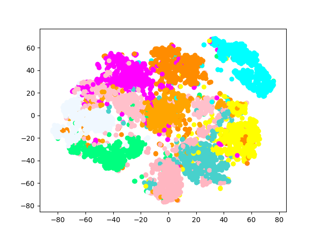

## "categorical variational autoencoder using the Gumbel-Softmax estimator" 实现

### 基本流程

使用VAE结构. 在 Mnist 数据集，隐变量使用 Gumbel-softmax 进行采样. 损失函数使用 KL 损失 + Sigmoid重建损失.

### 重构可视化
左侧为原始图像，中间部分为 `30*10` 的隐变量，右侧为重构结果.

### 编码可视化
可视化 6000 张图片作为输入的 encoder 输出的编码，用T-SNE降维后的结果。
同一种颜色标志的为同类别的图片. 可以看出，编码的聚簇比较合理。

